# Análisis Dinámico de APK con MobSF y Genymotion: InsecureBankv2

Este repositorio documenta el proceso para realizar un análisis dinámico de la aplicación Android vulnerable **InsecureBankv2** usando **Mobile Security Framework (MobSF)** junto con el emulador **Genymotion**.

## Índice

1. [¿Qué es MobSF?](#1-qué-es-mobsf)  
2. [Obtener InsecureBankv2](#2-obtener-insecurebankv2)  
3. [Instalar MobSF](#3-instalar-mobsf)  
4. [Acceder a MobSF](#4-Acceder-a-mobsf)  
5. [¿Qué es Genymotion?](#5-qué-es-genymotion)  
6. [Instalar Genymotion](#6-instalar-genymotion)  
7. [Emular un dispositivo móvil](#7-emular-un-dispositivo-móvil)  
8. [Ejecutar Back-end InsecureBankv2](#8-ejecutar-back-end-insecurebankv2)  
8. [Ejecutar InsecureBankv2 en el emulador](#9-ejecutar-insecurebankv2-en-el-emulador)  
9. [Análisis dinámico de la aplicación](#10-análisis-dinámico-de-la-aplicación)  
9.  [Interpretación de los resultados](#11-interpretación-de-los-resultados)

---
## 1. ¿Qué es MobSF?

**Mobile Security Framework (MobSF)** es una herramienta automatizada todo en uno para análisis de seguridad de aplicaciones móviles (Android/iOS/Windows). MobSF permite realizar análisis **estático**, **dinámico** y **basado en API**, y está especialmente diseñado para pruebas de seguridad móviles en entornos DevSecOps.

### Características principales:

- Análisis estático de APK, AAB, IPA y código fuente.
- Análisis dinámico (sandbox automatizado).
- Análisis de binarios y API REST.
- Informes detallados de seguridad y recomendaciones.

> Sitio oficial: https://mobsf.github.io/docs/

---

## 2. Obtener InsecureBankv2

**InsecureBankv2** es una aplicación vulnerable desarrollada con fines educativos para practicar análisis y explotación de fallos en apps móviles.

Puedes descargar la [Guía de uso de InsecureBankvs desde aquí.](files/InsecureBankv2UsageGuide.pdf)

### Pasos:

1. Clona el repositorio oficial:
   ```bash
   git clone https://github.com/dineshshetty/Android-InsecureBankv2.git
   ```

2. Compila el APK con Android Studio o utiliza una versión precompilada (si está disponible).
  Puedes descargarla desde el repositorio git del desarrollador: <https://github.com/dineshshetty/Android-InsecureBankv2/blob/master/InsecureBankv2.apk>
> ⚠️ **Nota:** Esta aplicación es intencionadamente insegura. No la instales en dispositivos personales o en entornos de producción.

---

## 3. Instalar MobSF

Puedes ejecutar MobSF localmente utilizando Docker o de forma manual. A continuación, se muestra el método recomendado (Docker):

### Opción 1: Usar Docker (recomendado)

```bash
git clone https://github.com/MobSF/Mobile-Security-Framework-MobSF.git
cd Mobile-Security-Framework-MobSF
docker build -t mobsf .
docker run -it -p 8000:8000 mobsf
```

También puedes hacerlo directamente  levantando la imagen de dockerhub:

```bash
docker run -it --rm -p 8000:8000 opensecurity/mobile-security-framework-mobsf:latest
```


Como hemos creado un contenedor interactivo, `docker run -it`, el terminal quedará abierto. En él podremos ver

### Opción 2: Instalación manual

Sigue la guía oficial en: https://mobsf.github.io/docs/#/installation

---

## 4. Acceder a MobSF

Una vez iniciado MobSF (ya sea por Docker o manualmente), accede a través de tu navegador:

>  <http://localhost:8000>

En la pantalla de autenticación usamos el usuario `mobsf` y la contraseña por defecto: `mobsf`.

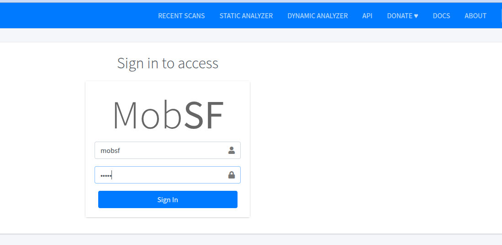


Verás la interfaz web de MobSF, lista para analizar APKs.

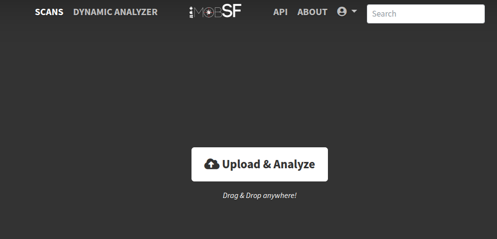
---

## 5. ¿Qué es Genymotion?

**Genymotion** es un emulador de Android que permite ejecutar máquinas virtuales de diferentes versiones y dispositivos. Es muy útil para realizar pruebas de seguridad móvil en entornos controlados.

> Sitio oficial: https://www.genymotion.com/

---

## 6. Instalar Genymotion

> Puedes descargar un documento de cómo descargar y crear un dispositivo virtual en [este documento de Rafael López García](files/InstalacionGenymotion.pdf).

1. Regístrate en [Genymotion](https://www.genymotion.com/account/create/). Deberás confirmar con el enlace enviado a tu correo electrónico
	
> En la versión gratuita nos ofrecen una versión trial de 30 días.

2. Descarga la versión para tu sistema operativo. En mi caso en `Linux` he descargado el archivo ` .run`.

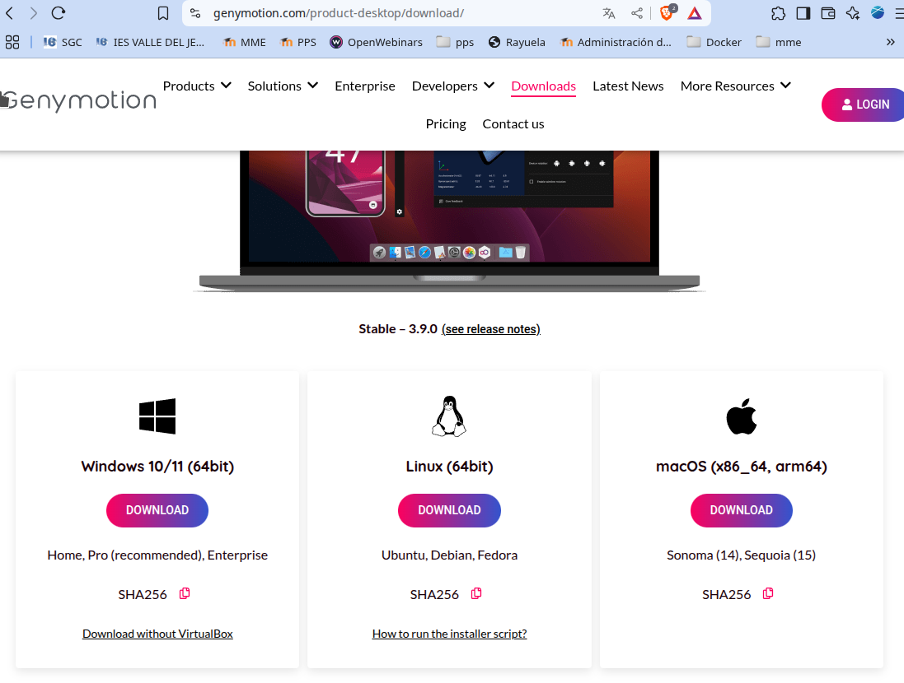

3. Instálalo. En mi caso lo he copiado e instalado en la carpeta `/opt`:

```bash
sudo cp genymotion-3.9.0-linux_x64.run /opt/
sudo chmod 755 genymotion-3.9.0-linux_x64.run 
sudo ./genymotion-3.9.0-linux_x64.run 
```
Una vez instalado en tu equipo lánzalo desde el botón de `inicio` de tu SO.

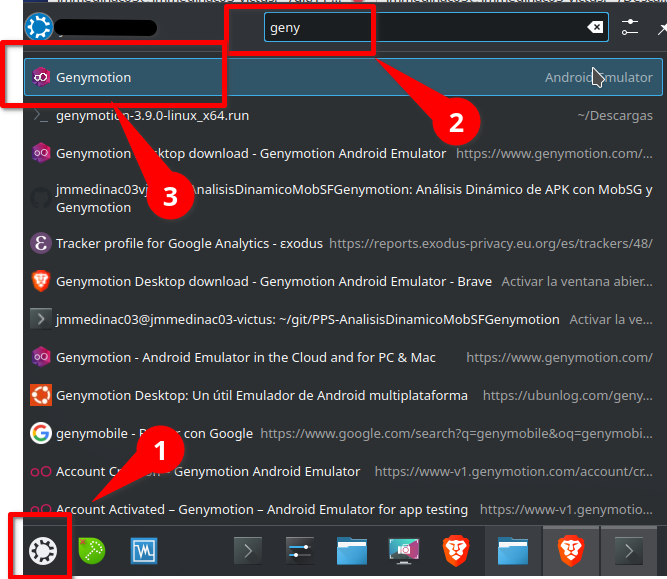

> Si es necesario, puedes usarlo en Máquina Virtual.

4. Inicia sesión con tu cuenta de Genymotion.

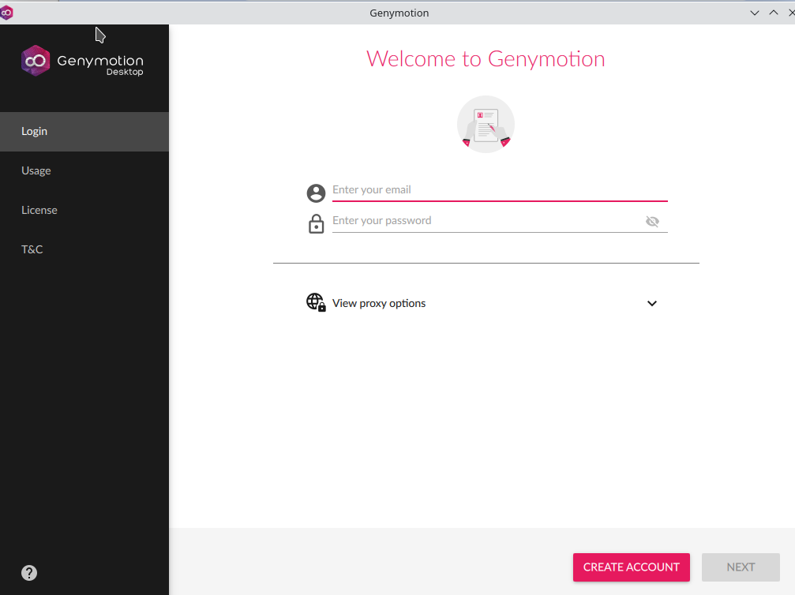


> Si no te has registrado, tendrás que hacerlo en este momento para acceder a la aplicación.

Selecciona `Personal use`. Veremos el siguiente aviso:
 
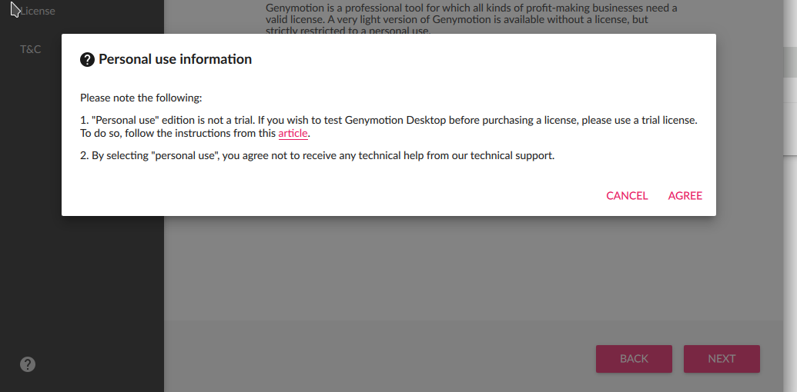

---

## 7. Ejecutar Back-end InsecureBankv2

InsecureBankv2 es una aplicación bancaria, por lo tanto tenemos:

- Aplicación Bancaria **Servidor** (Back-end).
- Aplicación Bancaria **Cliente**. En este caso APK para Android.


En este punto vamos a levantar la aplicación del servidor.

El desarrollador tiene creado un laboratorio en la carpeta `AndroLabServer`. En esencia vamos a:

- Crear un entorno virtual de Phyton para ejecutar el laboratorio.
- Instalar python (si no lo tienes instalado) y librerias de python.
- Ejecutar la aplicación.

La aplicación está escrito en Python 2.7, por lo que si tines instalado Python3 no se ejecutará correctamente.
Los módulos necesarios para arrancar la aplicación ya no vienen en los Linux modernos, sólo los incorpora hasta Ubuntu 22.04 LTS.

Para comprobar la versión de python que tenemos probamos con:

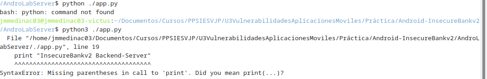

Como vemos en la imagen sólo nos detecta Python3. Al intentar ejecutar la aplicación nos da un error propio de que la función `print()` ha cambiado de `python2` a `python3`.

### Opción 1. Tienes instalado Python2

 Instalamos la librerías:

```bash
pip install -r requirements.txt
```

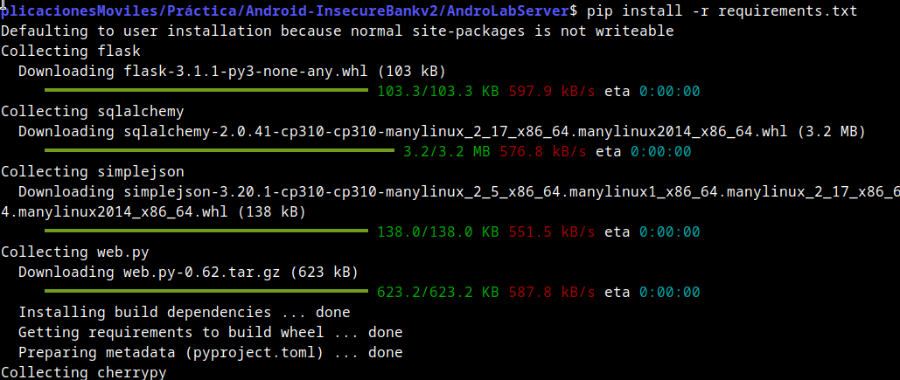

Aquí vemos cómo se ha instalado correctamente.

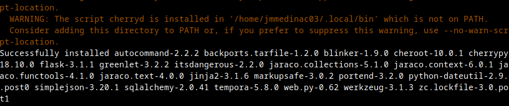

```bash
phyton app.py
```
### Opcion 2. Tienes instalado Python 3 :Instalación de Python2.7 y librerías necesarias.

Instalamos Python2 y las librerías necesarias.

```bash
sudo apt install python2
curl https://bootstrap.pypa.io/pip/2.7/get-pip.py --output get-pip.py
sudo python2 get-pip.py
pip2 install flask
pip2 install flask-sqlalchemy
pip2 install simplejson
pip2 install cherrypy
pip2 install web.py==0.51
pip2 install web.py
```
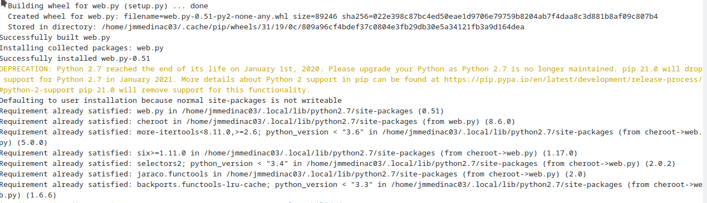


 E iniciamos el servidor:


```bash
 python2 app.py
```

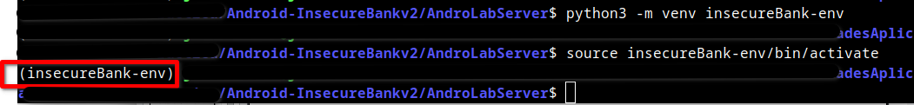

---
  
## 8. Emular un dispositivo móvil


1. Crea una nueva máquina virtual Android (preferiblemente Android 5.0 con x86).
 
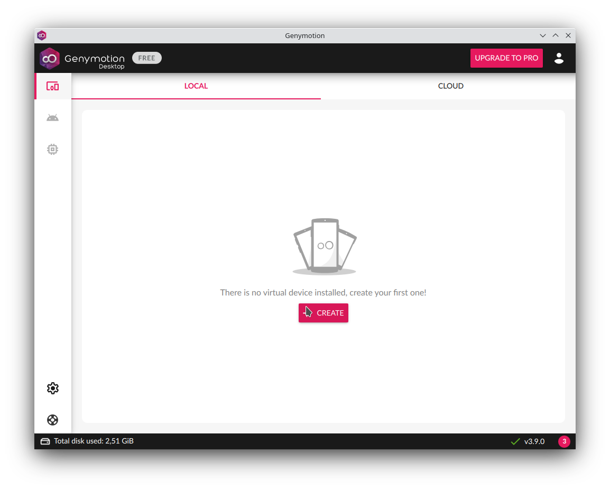

En los siguientes pasos podemos dejar todas las opciones tal y como están, salvo cambiarle el nombre al dispositivo, la versión de Android a la que nos interese e instalarle el teclado virutal. Aunque la opción “Enable Root Access” aparece desactivada, en principio sí que tendremos acceso de root.
- Seleccionamos un teléfono básico `Custom Phone`

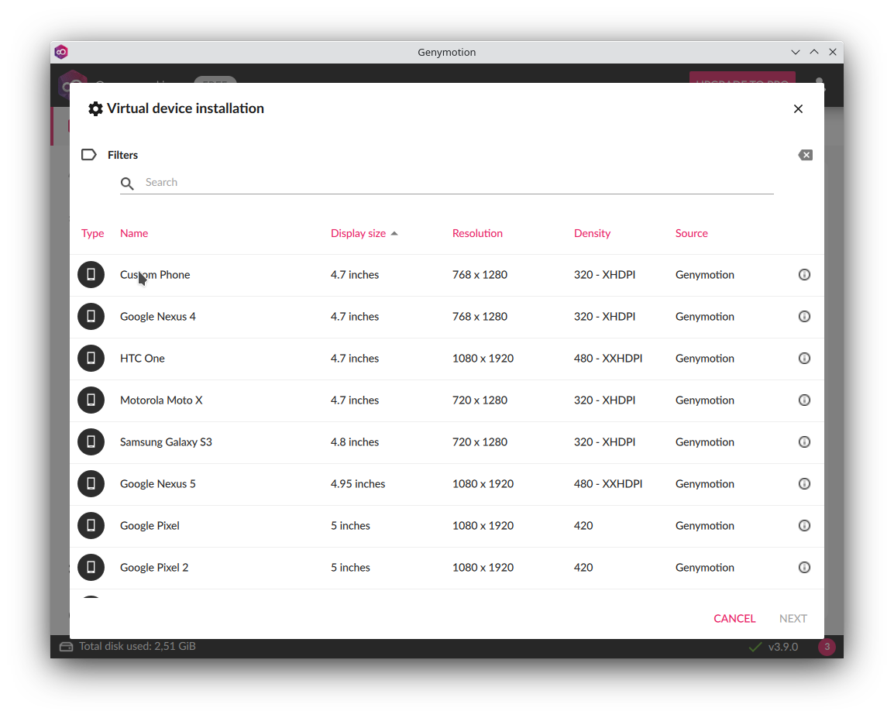

- Cambiamos la versión de Android, seleccionando `Android 5`.

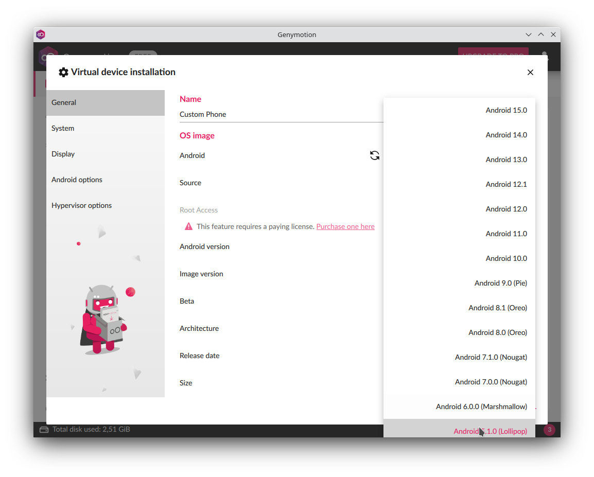

- Habilitamos teclado virtual en pantalla.

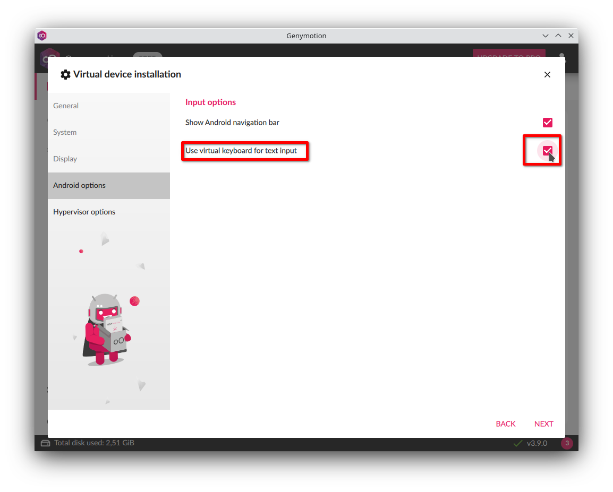

Al finalizar el proceso y darle a `Install` comenzará la creación del dispositivo. Tarda unos minutos.

- Iniciar el dispositivo. Darle al símbolo de `play`.

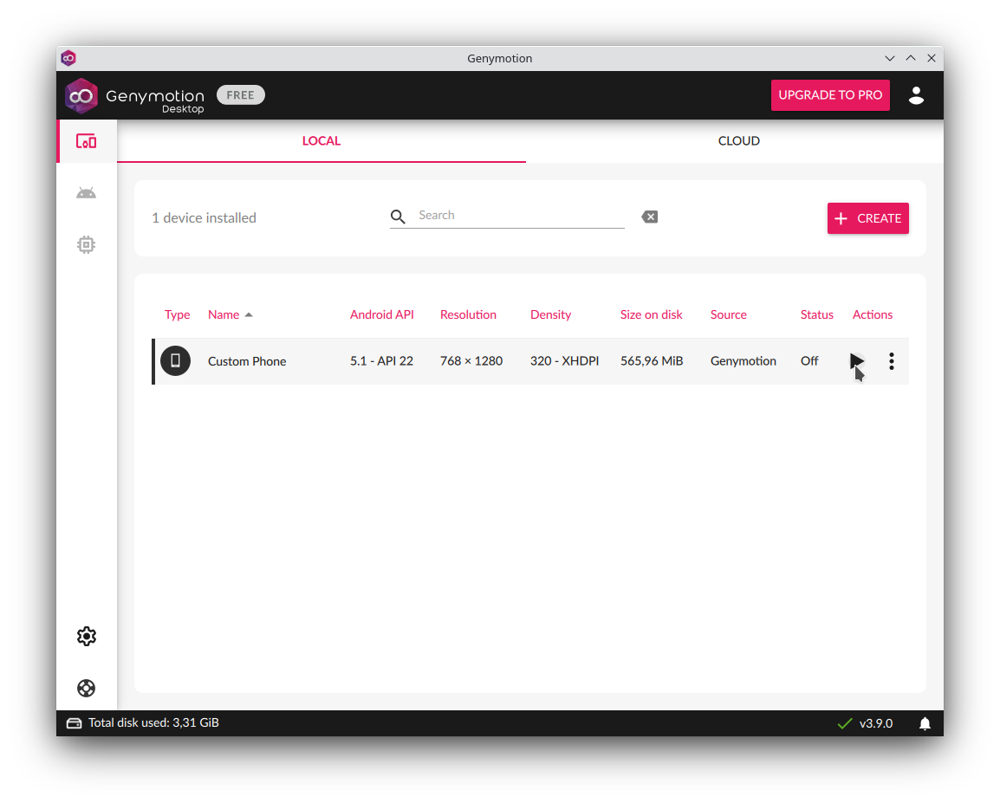

Nos aparece el dispositivo.

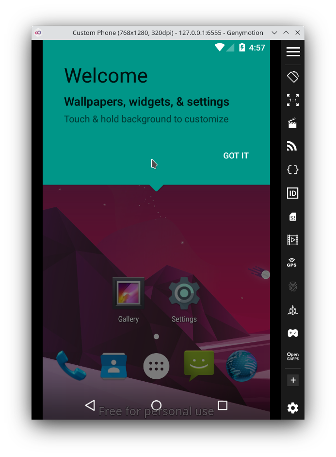

> 


2. Asegúrate de que tenga habilitado **ADB**.


3. Inicia la máquina virtual.

---

## 9. Ejecutar InsecureBankv2 en el emulador

1. Instalamos la aplicación en el emulador arrastrando el paquete de la aplicación sobre el emulador:

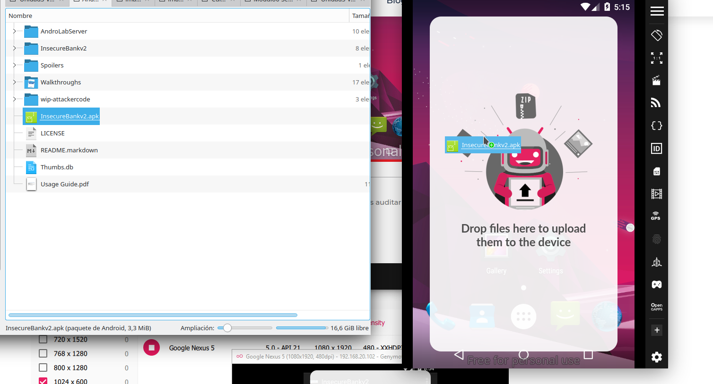

2. Finalizada la instalación vemos cómo nos aparece la ventana de login.


---

## 10. Análisis dinámico de la aplicación

1. Accede a MobSF en `http://localhost:8000`.
2. Selecciona la opción **Dynamic Analyzer**.
3. Asegúrate de que MobSF detecta el dispositivo emulado vía ADB.
4. Carga el APK de InsecureBankv2.
5. Sigue las instrucciones para iniciar el análisis dinámico.

> MobSF lanzará la app en el emulador y empezará a registrar comportamiento, tráfico, uso de permisos, etc.

---

## 11. Interpretación de los resultados

El informe dinámico incluirá información como:

- **Permisos en tiempo de ejecución**.
- **Tráfico de red y endpoints detectados**.
- **Interacciones con el sistema**.
- **Análisis de logs, broadcasts, servicios, etc.**
- **Captura de tráfico HTTPS (si está configurado con proxy o CA)**.

---

## 📘 Recursos adicionales

- [MobSF Documentation](https://mobsf.github.io/docs/)
- [Genymotion User Guide](https://docs.genymotion.com/)
- [InsecureBankv2 GitHub](https://github.com/dineshshetty/Android-InsecureBankv2)
- [Guía de uso de InsecureBankvs desde aquí.](files/InsecureBankv2UsageGuide.pdf)
- [Manual de uso de Genymotio de Rafa López](files/InstalacionGenymotion.pdf)

---

## ⚠️ Disclaimer

Este proyecto es solo para fines educativos. No uses estas herramientas sobre apps sin autorización expresa.

---

## Autor

Repositorio creado por [TuNombre], para prácticas de análisis dinámico de seguridad móvil en el contexto de PPS (Prácticas Profesionales Supervisadas).
